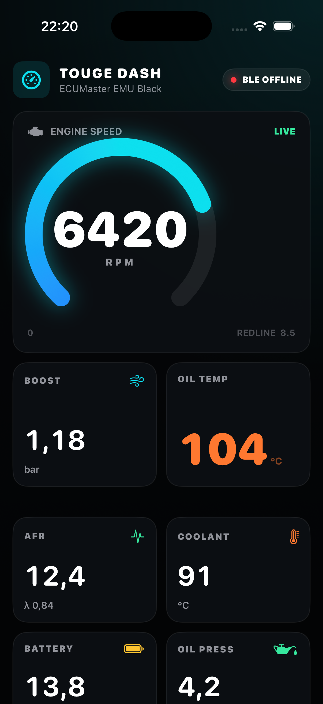
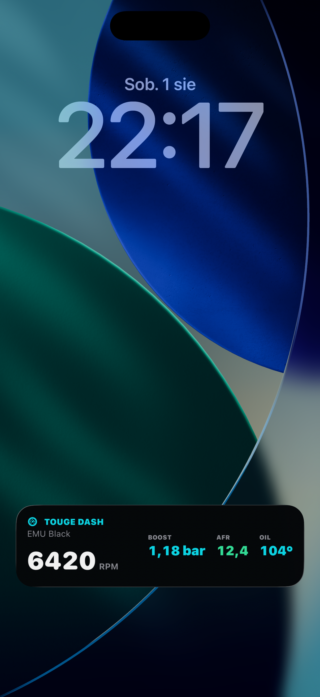
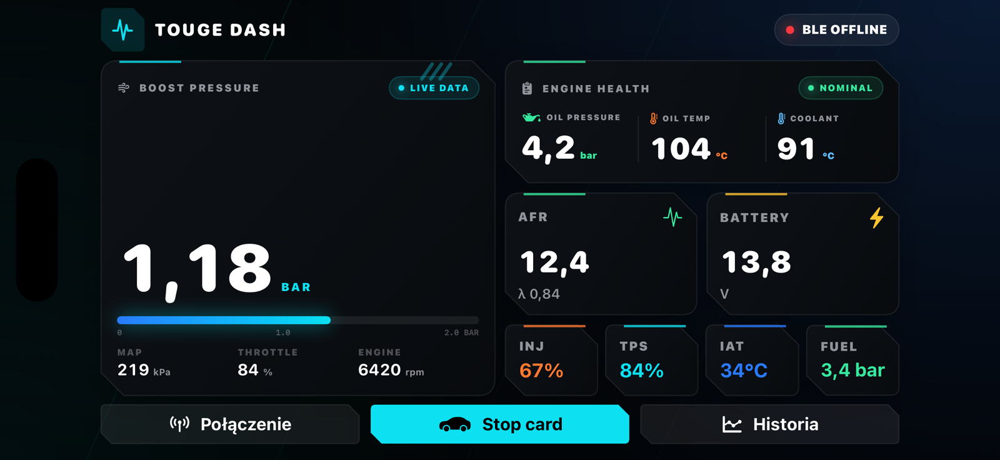
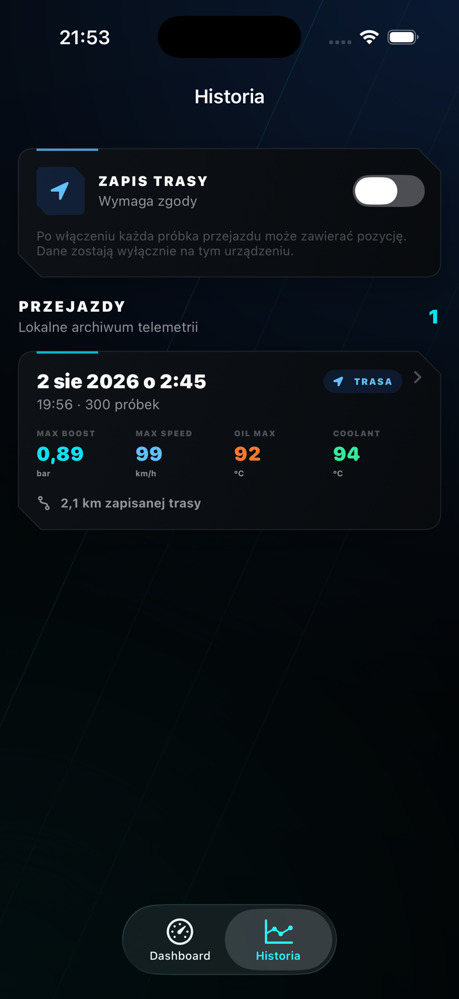
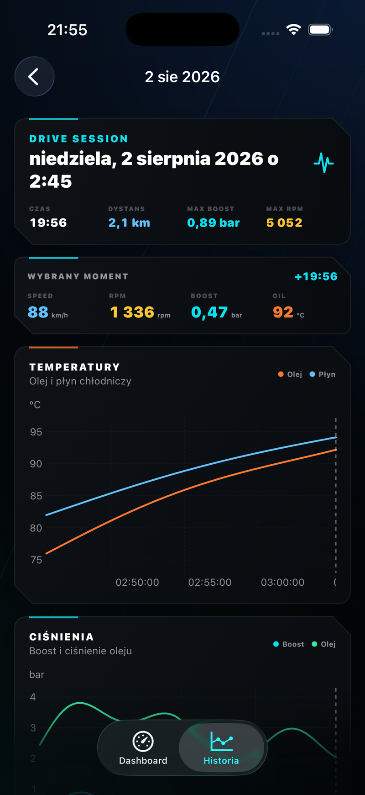
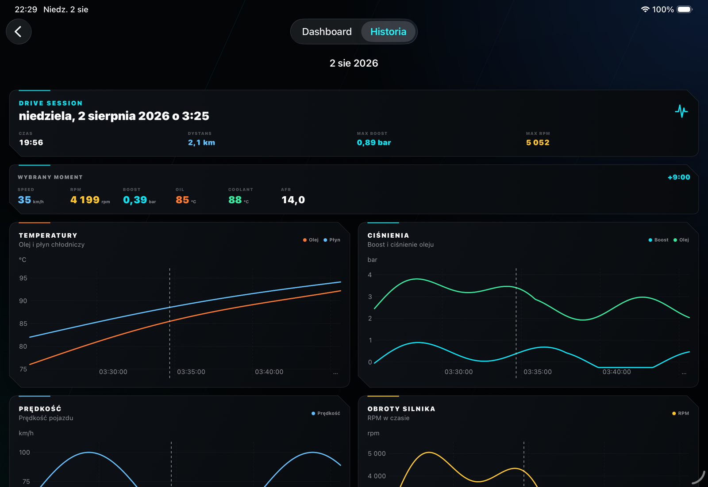
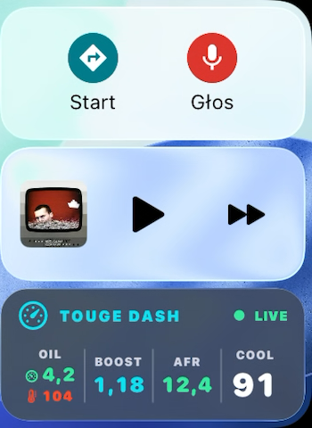
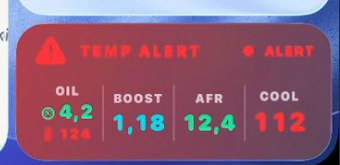
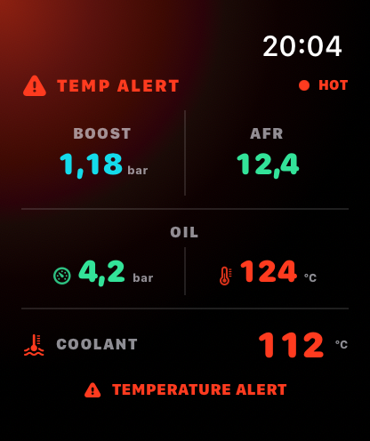
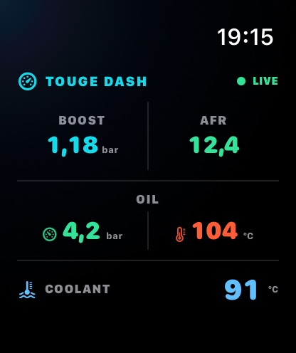

# Touge Dash

Natywne aplikacje mobilne do podglądu danych z ECUMaster EMU Black na Androidzie,
iPhonie, Apple Watch i ekranie CarPlay. Powstały po to, żeby najważniejsze parametry
silnika były zawsze pod ręką bez telefonu przyklejonego do szyby.

Kod protokołu jest niezależną implementacją — projekt nie zawiera kodu ani
zasobów z oficjalnego eDash.

<p align="center">
  
  
</p>

<p align="center">
  
</p>

<p align="center">
  
  
</p>

<p align="center">
  
</p>

<p align="center">
  
</p>

## Co działa

- automatyczne wykrywanie i łączenie z interfejsami ECUMaster BLE,
- odczyt ramek z `EMULOGGER` przez GATT `FFE0` / `FFE1`,
- RPM, boost/MAP, TPS, AFR/lambda, temperatury, ciśnienia i napięcie,
- konfigurowalny dashboard na Androida, iPhone'a i iPada, w pionie i poziomie,
- lokalna historia przejazdów z interaktywnymi wykresami i opcjonalną trasą GPS,
- lokalne nagrywanie przejazdu z odtwarzaniem zsynchronizowanym z telemetrią,
- eksport filmu do Zdjęć z konfigurowalną nakładką parametrów,
- automatyczne raporty incydentów obejmujące 30 sekund przed i 60 sekund po zdarzeniu,
- notatki przypinane do dokładnego momentu przejazdu,
- bezpieczne linki do raportów incydentów wysyłane mechanikowi bez dostępu do całego auta,
- Centrum alertów z progami per auto, pracą offline i synchronizacją zmian mechanika,
- opcjonalne konto i synchronizacja historii z Touge Dash Cloud,
- logowanie e-mail/hasło, Sign in with Apple oraz bezpieczny handoff Google/Facebook z panelu WWW,
- Live Activity uruchamiana automatycznie razem z aplikacją,
- mały widok Live Activity przygotowany pod CarPlay,
- dashboard Apple Watch z danymi przesyłanymi na żywo z iPhone'a,
- widgety iOS,
- diagnostyka pakietów BLE bezpośrednio w aplikacji,
- natywny symulator `EMULOGGER` na macOS do testów bez samochodu.

## Sprawdzony zestaw

Aktualna wersja była testowana na:

- emulatorze Pixel z Androidem 14 w pionie i poziomie,
- iPhone 14 Pro z iOS 26.5.2,
- Apple Watch Series 11 (46 mm) Simulator z watchOS 26.2,
- ECUMaster EMU Black,
- EDL-1 widocznym w BLE jako `EMULOGGER`,
- symulatorem BLE uruchomionym na Macu i fizycznym iPhonem.

Połączenie jest nawiązywane automatycznie. Aplikacja zapamiętuje ostatni
interfejs, więc przy kolejnych uruchomieniach nie trzeba otwierać listy
Bluetooth.

## Historia przejazdów

Gdy z EMU napływa telemetria, Touge Dash automatycznie zapisuje 10 próbek
na sekundę. Dłuższa niż 90 sekund przerwa rozpoczyna nowy przejazd. W zakładce
`Historia` można później porównać na wspólnej osi czasu:

- temperaturę oleju i płynu chłodniczego,
- boost i ciśnienie oleju,
- prędkość oraz obroty silnika,
- pozostałe parametry widoczne dla wybranego momentu.

Przesunięcie palcem po dowolnym wykresie ustawia wspólny kursor dla wszystkich
parametrów. Jeżeli użytkownik włączy `Zapis trasy` i udzieli zgody na
lokalizację, ten sam moment jest zaznaczany również na mapie. GPS jest
domyślnie wyłączony, a historia pozostaje wyłącznie na urządzeniu.

Historia działa offline niezależnie od konta. Po zalogowaniu aplikacja rozpoznaje
auto po UUID interfejsu Bluetooth, przy pierwszym połączeniu prosi o jego nazwę,
a następnie wysyła zaległe sesje partiami. Utrata internetu nie przerywa zapisu:
próbki zostają w lokalnej bazie i są dosyłane po odzyskaniu połączenia. Tokeny
sesji są przechowywane w Keychain na iOS i szyfrowanej pamięci na Androidzie.

### Nagrania przejazdów

Nagrywanie wideo jest opcjonalne i domyślnie wyłączone. Po jego włączeniu można
wybrać obiektyw, jakość oraz zapis dźwięku. Film rozpoczyna się i kończy razem z
sesją telemetrii, a w historii pozostaje przypisany do konkretnego przejazdu.
Odtwarzacz i wykresy korzystają ze wspólnej osi czasu: przesunięcie filmu ustawia
kursor telemetrii, a wskazanie momentu na wykresie przewija nagranie.

Nagrania nie są synchronizowane z API ani kopią iCloud. Lista historii pokazuje
ich rozmiar, a każdy plik można usunąć albo wyeksportować do aplikacji Zdjęcia.
Eksport może zachować surowy obraz lub wyrenderować wybrany szablon HUD z
prędkością, RPM, boostem, AFR, temperaturami i ciśnieniami. Szablony, pozycje i
rozmiary nakładek są konfigurowalne osobno dla filmu pionowego i poziomego oraz
zapisywane lokalnie. HUD można przeciągnąć bezpośrednio na podglądzie przed eksportem.

## Raporty incydentów

Aplikacja analizuje odebrane dane do 25 razy na sekundę. Po utrzymaniu się
niebezpiecznego warunku zapisuje osobny raport z buforem 30 sekund sprzed
zdarzenia i 60 sekund po nim. Wykrywane są:

- niskie ciśnienie oleju przy wysokich obrotach,
- zbyt uboga mieszanka pod doładowaniem,
- overboost,
- osobne progi temperatury płynu i oleju,
- niskie ciśnienie paliwa, jeśli kanał został włączony,
- niskie napięcie podczas pracy silnika.

Wszystkie progi, warunki obrotów i czas potwierdzenia można ustawić per auto w
Centrum alertów. Konfiguracja działa offline i synchronizuje się z panelem WWW,
gdzie może ją również zmienić mechanik mający dostęp do auta.

Raport zawiera wykresy, warunki wyzwolenia, trasę GPS i notatki dodane do
konkretnej próbki. Właściciel może utworzyć wygasający link i wysłać go
mechanikowi bez udostępniania reszty garażu.

Panel WWW korzysta z tego samego konta. Właściciel widzi tam wykresy, mapę,
eksport CSV i dane live, a auto może udostępnić mechanikowi albo obserwatorowi.
Backend oraz panel są utrzymywane w osobnych prywatnych repozytoriach.

## Android

Aplikacja Android jest natywna — Kotlin, Jetpack Compose, Room, WorkManager,
CameraX i Media3. Nie jest opakowaniem strony WWW. Wymaga Androida 8.0 (API 26)
lub nowszego. Wydanie można pobrać bez konta Google Play:

[Pobierz najnowszy Touge Dash APK](https://github.com/karlos1998/touge-dash/releases/latest/download/touge-dash-android.apk)

Po pobraniu system może poprosić o jednorazową zgodę na instalację aplikacji z
przeglądarki. Aktualizacje są podpisywane tym samym kluczem, więc kolejne APK
instalują się na poprzedniej wersji bez utraty lokalnej historii.

Projekt otwiera się w Android Studio przez katalog `android/`. Build developerski:

```bash
cd android
./gradlew testDebugUnitTest lintDebug assembleDebug
```

Android automatycznie wyszukuje wyłącznie pasujące interfejsy ECUMaster, zapamiętuje
ostatni EMULOGGER i utrzymuje zapis w usłudze pierwszoplanowej po wygaszeniu ekranu.
Połączenie z FFE1 pozostaje tylko do odczytu. Zapis GPS jest domyślnie wyłączony.

## iPhone

Wymagany jest Xcode 26 oraz iPhone z iOS 26. Projekt Xcode jest dołączony do
repozytorium:

```bash
open ios/TougeDash.xcodeproj
```

Przed pierwszym uruchomieniem wybierz swój Development Team dla targetów
`TougeDash` i `TougeDashWidgets`. Jeżeli domyślne identyfikatory są zajęte na
Twoim koncie Apple Developer, zmień bundle ID oraz App Group w
[`ios/project.yml`](ios/project.yml).

Dokładniejsze informacje o podpisywaniu, BLE i diagnostyce są w
[`ios/README.md`](ios/README.md).

### CarPlay

Touge Dash nie jest pełną aplikacją CarPlay i nie pojawia się na liście ikon.
Używa Live Activity w rozmiarze `ActivityFamily.small`. Po podłączeniu telefonu
aktywność pojawia się w CarPlay Dashboard albo jako powiadomienie. Pokazuje
ciśnienie i temperaturę oleju, boost, AFR oraz temperaturę płynu chłodniczego.

### Apple Watch

Aplikacja zegarkowa pokazuje boost, AFR, ciśnienie i temperaturę oleju oraz
temperaturę płynu chłodniczego. iPhone przekazuje dane przez WatchConnectivity
maksymalnie dwa razy na sekundę, a zegarek zachowuje ostatni odczyt po utracie
połączenia. Po przekroczeniu progów temperatury ustawionych dla danego auta
zegarek zmienia kolory i uruchamia haptyczne ostrzeżenie. Ten sam alert wyświetla
pilne powiadomienie na iPhonie oraz zmienia kartę Live Activity i CarPlay na czerwoną.

<p align="center">
  
  
</p>

<p align="center">
  
</p>

## Protokół

Połączenie Bluetooth jest celowo tylko do odczytu. Aplikacja subskrybuje
notyfikacje GATT i odczytuje charakterystyki; nie wykonuje `writeValue` i nie
wysyła do ECU ani loggera poleceń, map, nastaw lub konfiguracji.

Strumień ECUMaster składa się z pięciobajtowych ramek:

```text
[channel] [0xA3] [value high] [value low] [checksum]
```

`checksum` to najmłodszy bajt sumy pierwszych czterech bajtów. Parser działa
strumieniowo, radzi sobie z ramkami rozdzielonymi pomiędzy notyfikacje BLE i
wraca do synchronizacji po uszkodzonych danych.

## Symulator EMULOGGERA na macOS

Do repozytorium jest dołączona natywna aplikacja macOS reklamująca przez BLE
usługę `FFE0` i charakterystykę `FFE1`. Wysyła prawidłowe ramki telemetrii 10
albo 25 razy na sekundę, udostępnia gotowe scenariusze jazdy i pozwala ręcznie
zmieniać parametry. Dzięki temu można sprawdzić dashboard, nagrania, historię,
alerty i reconnect bez uruchamiania samochodu.

Symulator nie obsługuje zapisów do BLE ani komunikacji z ECU. Przy włączonej
synchronizacji online jest rozpoznawany jako osobne auto, któremu można nadać
własną nazwę. Instrukcja uruchomienia znajduje się w
[`tools/EMULoggerSimulator/README.md`](tools/EMULoggerSimulator/README.md).

## Układ repozytorium

```text
ios/                 aplikacje iPhone/Apple Watch, widgety i Live Activity
android/             natywna aplikacja Android i konfiguracja wydania APK
tools/EMULoggerSimulator/  natywny symulator BLE dla macOS
docs/screenshots/    zrzuty ekranów używane w README
```

Backend Touge Dash Cloud i panel webowy są osobnymi częściami platformy i nie
wchodzą w skład tego repozytorium.

## Testy

Android:

```bash
cd android
./gradlew testDebugUnitTest lintDebug assembleDebug
```

iOS:

```bash
xcodebuild \
  -project ios/TougeDash.xcodeproj \
  -scheme TougeDash \
  -destination 'platform=iOS Simulator,name=iPhone 17 Pro' \
  test
```

## Ważne

To rejestrator i dodatkowy wyświetlacz, a nie homologowany przyrząd. Przed użyciem w czasie
jazdy porównaj wskazania z ECUMaster Client. Projekt nie jest powiązany ani
autoryzowany przez ECUMaster.

## Licencja

MIT — szczegóły w pliku [`LICENSE`](LICENSE).
